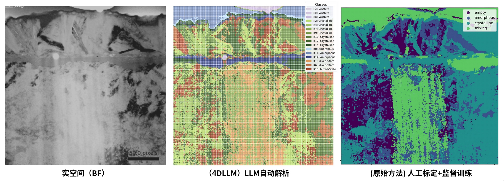

# 4DLLM

[](https://www.python.org/downloads/)
[](https://www.postgresql.org/download/)
[](https://www.docker.com/)
[](https://docs.astral.sh/uv/) 
[](https://modelcontextprotocol.io/)
[](https://opensource.org/licenses/MIT)

**语言**: [English](README_en.md) | 中文

一个强大的、基于数据库的 MCP 服务器，用于自动化处理、分析和解释 4D-STEM 数据。它集成了 K-Means 聚类、大型语言模型 (LLM) 语义分析和晶体学模拟 (CIF) 工作流，并通过 PostgreSQL 确保所有分析结果的完整可追溯性。

## ✨ 核心特性

*   **🔧 端到端工作流**: 从原始 `.mib` 文件到 LLM 生成的语义标签和晶体结构识别，全流程自动化。
*   **🧠 LLM 集成**: 利用大语言模型（如 GPT-4）为衍射图案聚类提供人类可读的共识描述和分类标签。
*   **🏗️ 数据库中心化**: 所有数据、参数和结果均存储在 PostgreSQL 中，保证分析的可重复性和完美溯源。
*   **⚡ MCP 协议支持**: 作为标准 MCP 服务器，可与 Claude.ai、Cursor 等任何 MCP 客户端无缝集成，极大提升研究效率。
*   **🔬 领域专家设计**: 专为材料科学和电子显微镜研究者设计，提供 CIF 模拟与对比等专业功能。
  
## 🔧 项目架构图

<div align="center">
  <picture>
      
  </picture>
  <picture>
      
  </picture>
</div>

## 🔬 解析结果

<div align="center">
  <picture>
      
  </picture>
</div>

相较传统（人工标定+监督训练）方法：
- 大幅提高分类颗粒度与准确度
- 发现更多材料特征
- MCP自动化显著减少人工工作量，提高效率
- 数据库化存储与管理，便于后续分析与扩展

## 🚀 快速开始

### 环境要求
请确保你的系统已安装：
- Python 3.13+
- Docker 和 Docker Compose
- UV 包管理器

### 安装与设置
1.  **克隆仓库**:
    ```bash
    git clone https://github.com/Frank0415/4DLLM.git
    cd 4DLLM
    ```

2.  **使用 UV 安装依赖**:
    ```bash
    uv sync
    ```

3.  **启动数据库**:
    ```bash
    docker-compose -f docker/docker-compose.yml up -d
    ```

4.  **初始化数据库结构**:
    ```bash
    python setup_database.py
    ```

5.  **配置 LLM API 密钥和数据库凭证**:
    ```bash
    cp config/db_config_example.json config/database.json
    cp config/api_keys_example.json config/api_keys.json
    ```
    在 `config/database.json` 中填写数据库凭证，在 `config/api_keys.json` 中配置LLM API密钥。

## 📖 文档

请参阅我们的[**完整文档**](docs/documentation_zh.md)以获取全面的使用指南和 MCP 工具列表。

## 📜 许可证

本项目采用 **MIT 许可证** - 详见 [LICENSE](LICENSE) 文件。

## 🙏 致谢

本项目的开发建立在以下优秀开源项目的基础之上。我们向其创作者表示深切感谢：
- **[crystaldba/postgres-mcp](https://github.com/crystaldba/postgres-mcp)** (MIT) - MCP服务器框架。
- **[ia-programming/mcp-images](https://github.com/ia-programming/mcp-images)** (MIT) - 图像处理功能。
- **[blazickjp/arxiv-mcp-server](https://github.com/blazickjp/arxiv-mcp-server)** (Apache-2.0) - 用于ArXiv论文分析的MCP服务器。

---
*免责声明: 本项目是一个研究平台，有效使用可能需要领域专业知识（4D-STEM，材料科学）。*