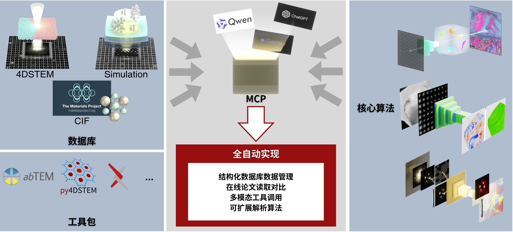
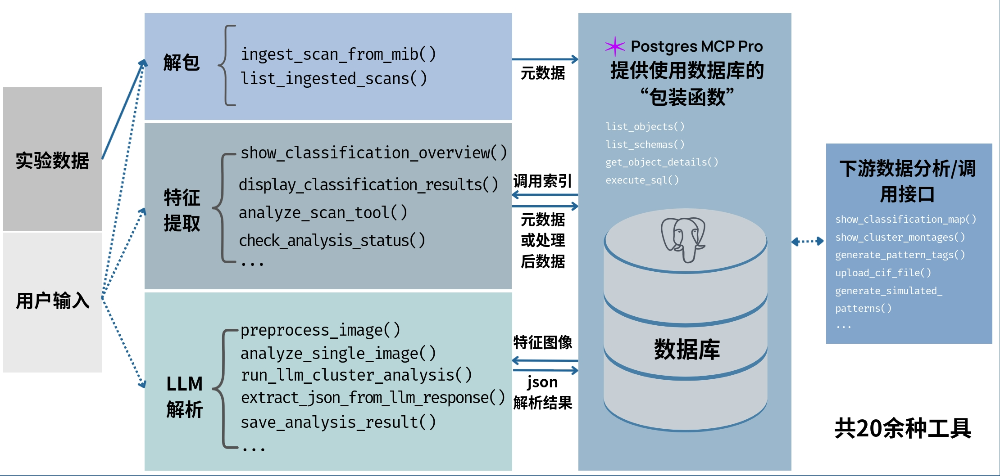

# 4DLLM - 4DSTEM Material Analysis Tool

A core classification, data analysis, and relationship-building tool for microscopic materials tailored to 4DSTEM.

---

This project uses [postgres-mcp](https://github.com/crystaldba/postgres-mcp), with the original license available at [LICENSE-postgres-mcp](LICENSES/LICENSE-postgres-mcp).

## Structure

<div align="center">
  <picture>
      
  </picture>
  <picture>
      
  </picture>
</div>

## Quick Start

### 1. Environment Setup

Ensure the following dependencies are installed:
- Python 3.13+
- PostgreSQL 17+
- Docker (recommended for database)
- uv package manager

### 2. Database Setup

```bash
# Start database containers
docker-compose up -d

# Initialize database tables
python init_enhanced_db.py
```

### 3. Configuration

Copy and edit configuration files:
```bash
cp config/database.json.example config/database.json
cp config/api_keys.json.example config/api_keys.json
```

Fill in database credentials in `config/database.json` and configure LLM API keys in `config/api_keys.json`.

## Core Features

### Data Processing Workflow

1. **Data Import**: Convert raw .mib files to .mat format and store in database
2. **Clustering Analysis**: Use K-Means for unsupervised classification of diffraction patterns
3. **LLM Analysis**: Semantic analysis of clustering results using large language models
4. **Result Storage**: Persist analysis results to database

### Command Line Tools

```bash
# Import data
python main_pipeline_import.py /path/to/data.mib

# Clustering analysis
python helper/analyze_scan_cli.py --scan-id 1 --k-clusters 16

# LLM analysis
python enhanced_llm_analysis_pipeline.py scan_name
```

## Project Structure

```
4DLLM/
├── config/                 # Configuration files
├── helper/                 # Command line tools
├── postgres_mcp/          # Database related modules
├── api_manager/           # API key management
├── docker/                # Docker configuration
├── Data/                  # Processed data files
├── Raw/                   # Raw data files
└── llm_analysis_outputs/  # LLM analysis results
```

## Database Design

The database includes the following core tables:
- `scans`: Scan experiment metadata
- `raw_mat_files`: Raw .mat file references
- `diffraction_patterns`: Basic diffraction point data
- `clustering_runs`: Clustering experiment logs
- `identified_clusters`: Identified cluster information
- `pattern_cluster_assignments`: Point-to-cluster assignments
- `llm_analyses`: LLM analysis results
- `llm_analysis_results`: Final analysis results

## Development Guide

### Adding New Features

1. Create a new branch for development
2. Implement the feature and add corresponding tests
3. Update documentation
4. Submit a Pull Request

### Database Modifications

To modify the database structure:
1. Update `enhanced_unified_database_schema.sql`
2. Modify the SQL statement in `init_enhanced_db.py`
3. Run `python init_enhanced_db.py` to reinitialize the database

## Troubleshooting

### Common Issues

1. **Database Connection Failed**: Check if Docker containers are running and verify database credentials
2. **LLM API Errors**: Check API key configuration and ensure network connectivity
3. **Insufficient Memory**: Reduce batch size or switch to CPU processing

### Getting Help

If you encounter issues, please refer to the relevant documentation or submit an Issue.