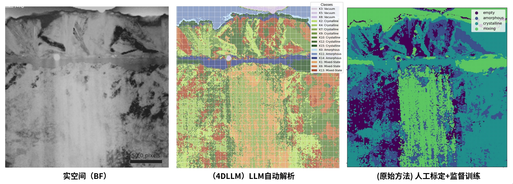

# 4DLLM

[](https://www.python.org/downloads/)
[](https://www.postgresql.org/download/)
[](https://www.docker.com/)
[](https://docs.astral.sh/uv/) 
[](https://modelcontextprotocol.io/)
[](https://opensource.org/licenses/MIT)

**Language**: English | [中文 / Chinese](README.md)

A powerful, database-centric MCP Server for automating the processing, analysis, and interpretation of 4D-STEM data. It integrates K-Means clustering, Large Language Model (LLM) semantic analysis, and crystallographic simulation (CIF) workflows, with PostgreSQL ensuring full traceability of all results.

## ✨ Core Features

*   **🔧 End-to-End Workflow**: Full automation from raw `.mib` files to LLM-generated semantic tags and crystal structure identification.
*   **🧠 LLM Integration**: Leverages Large Language Models (e.g., GPT-4) to provide human-readable consensus descriptions and classification tags for diffraction pattern clusters.
*   **🏗️ Database-Centric**: All data, parameters, and results are stored in PostgreSQL, guaranteeing reproducible analysis and perfect traceability.
*   **⚡ MCP Protocol Support**: As a standard MCP Server, it integrates seamlessly with any MCP client (like Claude.ai, Cursor), dramatically enhancing research efficiency.
*   **🔬 Domain Expert Design**: Designed for materials scientists and electron microscopists, offering specialized features like CIF simulation and comparison.

## 🏗️ Structure

<div align="center">
  <picture>
      
  </picture>
  <picture>
      
  </picture>
</div>

## 🔬 Results

<div align="center">
  <picture>
      
  </picture>
</div>

## 🚀 Quick Start

### Prerequisites
Ensure you have the following installed:
- Python 3.13+
- Docker and Docker Compose
- UV package manager

### Installation & Setup
1.  **Clone the repository**:
    ```bash
    git clone https://github.com/Frank0415/4DLLM.git
    cd 4DLLM
    ```

2.  **Sync dependencies with UV**:
    ```bash
    uv sync
    ```

3.  **Start the database**:
    ```bash
    docker-compose -f docker/docker-compose.yml up -d
    ```

4.  **Initialize the database schema**:
    ```bash
    python setup_database.py
    ```

5.  **Configure API keys and database credentials**:
    ```bash
    cp config/db_config_example.json config/database.json
    cp config/api_keys_example.json config/api_keys.json
    ```
    Fill in database credentials in `config/database.json` and configure LLM API keys in `config/api_keys.json`.

## 📖 Documentation

For comprehensive guides and available MCP tools, please refer to our [**full documentation**](docs/documentation.md).

## 📜 License

This project is licensed under the **MIT License** - see the [LICENSE](LICENSE) file for details.

## 🙏 Acknowledgments

This project is built upon and inspired by several incredible open-source projects. We are deeply grateful to their creators:
- **[crystaldba/postgres-mcp](https://github.com/crystaldba/postgres-mcp)** (MIT) - The foundation of our MCP Server.
- **[ia-programming/mcp-images](https://github.com/ia-programming/mcp-images)** (MIT) - For image handling capabilities.
- **[blazickjp/arxiv-mcp-server](https://github.com/blazickjp/arxiv-mcp-server)** (Apache-2.0) - Inspiration for our related [4DLLM-arxiv-mcp-server](https://github.com/Frank0415/4DLLM-arxiv-mcp-server).

---
*Disclaimer: This project is a research platform and may require domain-specific expertise (4D-STEM, materials science) to use effectively.*